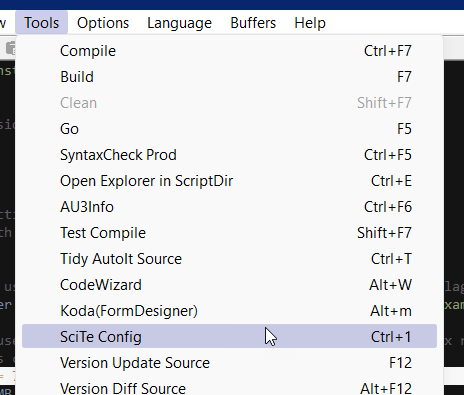
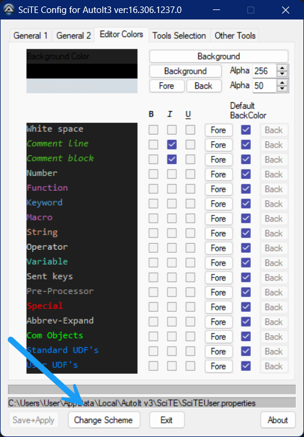
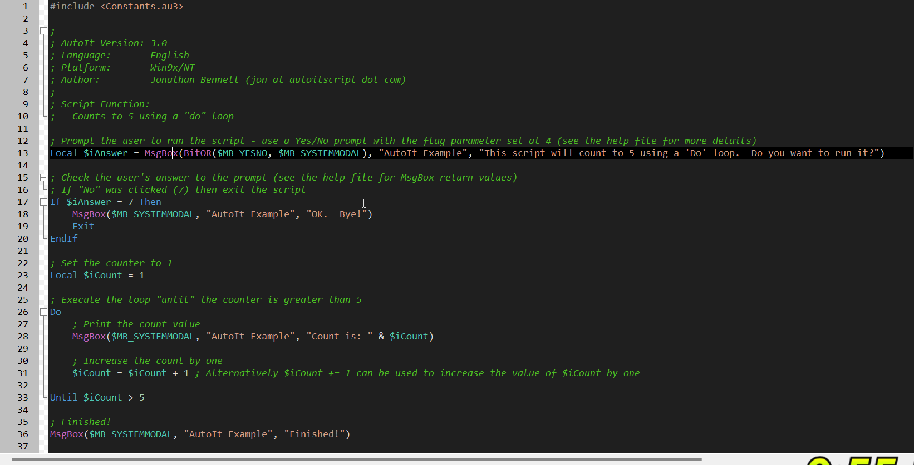

# How to change themes on AutoIt SciTE
There are a number of themes included with the app
if you wish to create a custom theme follow these instructions

## steps

create a new text file
open up the dark.SciTEConfig as an example then copy and paste the contents
modify the file to your liking
save the file with your petered name for example Mytheme with extension .SciTEConfig
then copy this file to the following directory:

    c:\Users\[Username]\AppData\Local\AutoIt v3\SciTE\SciTEConfig

where Username is replaced with you user account

Then open up a file with SciTE editor
select from the main window Tools-->SciTE Config as shown in figure 1

figure 1
select the tab Editor colors
at the bottom of the window d=select change themeas shown in figure 2

figure 2
this will display a drop down list 
select the desired theme or the one just created MyTheme
press ok
click save and apply
exit
if you have code already open you can see the changes as shown in figure 3

figure 3